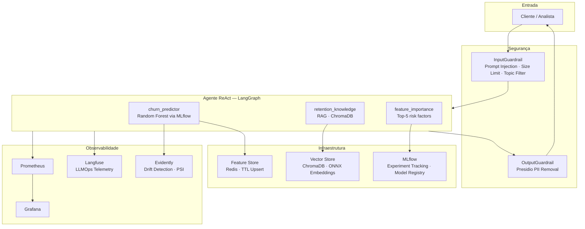

# Datathon MLET6 - Grupo 65 — Telco Churn Intelligence Platform

> **FIAP Pós-Tech MLET · Fase 05 — Deploy Avançado de IA Generativa**

Plataforma MLOps completa para predição de churn e recomendação de retenção em operadoras de telecomunicações. Combina um modelo de classificação clássico com um agente ReAct baseado em LLM, RAG sobre base de conhecimento proprietária, observabilidade full-stack e governança para conformidade LGPD.

[](https://github.com/michelhilg/datathon-grupo-65/actions/workflows/ci.yml)
[](https://www.python.org/downloads/release/python-3110/)
[](#testes)
[](#maturidade-mlops)

---

## Sumário

- [Contexto e Solução](#contexto-e-solução)
- [Arquitetura](#arquitetura)
- [Maturidade MLOps](#maturidade-mlops)
- [Como esse Projeto Resolve os Gaps Comuns em Plataformas de ML](#como-esse-projeto-resolve-os-gaps-comuns-em-plataformas-de-ml)
- [Pré-requisitos](#pré-requisitos)
- [Configuração do ambiente](#configuração-do-ambiente)
- [Quickstart](#quickstart)
- [Estrutura do Repositório](#estrutura-do-repositório)
- [Etapas do Projeto](#etapas-do-projeto)
  - [Etapa 1 — Dados e Baseline](#etapa-1--dados-e-baseline)
  - [Etapa 2 — LLM, Agente e Serving](#etapa-2--llm-agente-e-serving)
  - [Etapa 3 — Avaliação e Observabilidade](#etapa-3--avaliação-e-observabilidade)
  - [Etapa 4 — Segurança e Governança](#etapa-4--segurança-e-governança)
- [API](#api)
- [Monitoramento LLM com Langfuse](#monitoramento-llm-com-langfuse)
- [Testes](#testes)
- [CI/CD](#cicd)
- [Documentação de Governança](#documentação-de-governança)
- [Referências](#referências)
- [Licença](#licença)

---

## Contexto e Solução

Operadoras de telecomunicações enfrentam taxas de churn que podem superar 25% ao ano. Identificar clientes em risco com antecedência suficiente para agir é o diferencial entre uma campanha de retenção eficaz e a perda da receita.

Este projeto entrega uma plataforma end-to-end que combina duas camadas complementares: um modelo de classificação clássico para predição de risco com baixa latência, e um agente de linguagem que traduz o risco em recomendações de retenção acionáveis — contextualizado por uma base de conhecimento sobre padrões de churn e estratégias da indústria.

A solução foi construída seguindo práticas de MLOps nível 2, com rastreabilidade de experimentos, detecção de drift, guardrails de segurança e conformidade LGPD desde a concepção.

---

## Arquitetura



---

## Maturidade MLOps

Alinhado ao **Microsoft MLOps Maturity Model Nível 2** em todas as dimensões críticas:

| Dimensão | Implementação |
|---|---|
| Experiment Management | MLflow com métricas, parâmetros, artifacts e tags padronizadas |
| Model Management | Model Registry com versionamento, lineage e champion-challenger |
| CI/CD | GitHub Actions: lint (ruff) → testes (pytest ≥60%) → build |
| Monitoring | Prometheus + Grafana + Langfuse + Evidently (PSI) |
| Data Management | DVC para versionamento, dados sintéticos em dev/CI |
| Feature Management | Redis feature store com upsert incremental e TTL |

---

## Como esse Projeto Resolve os Gaps Comuns em Plataformas de ML

Os gaps abaixo são derivados de avaliações reais de maturidade MLOps descritos na proposta do Datathon FIAP. A tabela mostra como cada um é endereçado neste repositório:

| Gap | Anti-padrão | Solução implementada |
|---|---|---|
| **GAP 01** — Ausência de monitoramento | Modelo deployado sem nenhuma verificação | Prometheus + Grafana para métricas operacionais; Langfuse para qualidade LLM; Evidently para drift de features e predições; alertas configurados em [configs/alert.rules.yml](configs/alert.rules.yml) |
| **GAP 02** — Notebook como SPOF | Um único notebook dispara todo o pipeline de produção | Cada etapa é um script isolado (`prepare_data.py`, `train.py`, `export_model.py`, `build_index.py`); pipeline declarativo via DVC; deploy via CI/CD — nenhum notebook em path crítico |
| **GAP 03** — Feature store destrutivo (full-flush) | FLUSHALL + bulk load cria janela de store vazio | Redis com upsert incremental (`HSET` + TTL) em [src/features/feature_store.py](src/features/feature_store.py) — o store nunca fica vazio durante atualizações |
| **GAP 04** — Cobertura de testes próxima a zero | Quality gates triviais; ausência de pytest | 10 módulos de teste cobrindo features, modelo, agente, API, guardrails, monitoring, champion-challenger e avaliação; gate de ≥ 60% no CI via `--cov-fail-under=60` |
| **GAP 05** — Sem governança de versionamento | MLflow com metadata inconsistente ou ausente | Tags obrigatórias (`model_type`, `framework`, `owner`, `phase`) em todo run; Model Registry com lineage; champion-challenger antes de qualquer promoção |
| **GAP 06** — Sem detecção de drift | Modelo esquecido após deploy; degradação silenciosa | Evidently PSI com thresholds configuráveis (`warning > 0.1`, `retrain > 0.2`) em [src/monitoring/drift.py](src/monitoring/drift.py); endpoint `POST /drift-report` expõe o relatório |
| **GAP 07** — Ausência de retraining automatizado | Retraining manual e ad-hoc | Workflow `retraining.yml` agendado por cron; avaliação champion-challenger com `delta_auc ≥ 0.005` obrigatório para promoção |
| **GAP 08** — Ambiente de dev sem dados | Testes acontecem direto em produção | DVC versiona os dados brutos garantindo reprodutibilidade; o CI executa o pipeline completo sem depender de dados de produção |
| **GAP 09** — Skills gap em engenharia de software | Sem type hints, sem testes, secrets no código | Type hints em todas as funções públicas; `ruff` como linter no CI; `pyproject.toml` com dependências gerenciadas; logging estruturado; secrets exclusivamente via `.env` |

---

## Pré-requisitos

| Ferramenta | Versão |
|---|---|
| Python | 3.11 |
| [uv](https://docs.astral.sh/uv/) | ≥ 0.4 |
| Docker + Docker Compose | ≥ 24 |
| OpenAI API Key | — |
| Langfuse Account (opcional) | — |

---

## Configuração do ambiente

Copie o template e preencha as variáveis antes de qualquer passo:

```bash
cp .env.example .env
```

### Variáveis obrigatórias

| Variável | Descrição | Como obter |
|---|---|---|
| `OPENAI_API_KEY` | Chave de autenticação da API OpenAI | [platform.openai.com/api-keys](https://platform.openai.com/api-keys) |
| `OPENAI_MODEL` | Modelo LLM utilizado pelo agente | Padrão: `gpt-4o-mini`. Use `gpt-4o` para maior qualidade |

### MLflow

| Variável | Descrição | Valor padrão |
|---|---|---|
| `MLFLOW_TRACKING_URI` | URI do servidor de tracking | `http://localhost:5000` (local) |
| `MLFLOW_EXPERIMENT_NAME` | Nome do experimento no MLflow | `telco-churn` |

> **Nota**: o arquivo `mlflow.db` está no `.gitignore`. Ao clonar o repositório do zero, o tracking history não estará disponível — é necessário executar o pipeline de treinamento localmente para reconstituí-lo (ver [Quickstart](#quickstart)).

### Langfuse — observabilidade de LLM

| Variável | Descrição | Como obter |
|---|---|---|
| `LANGFUSE_PUBLIC_KEY` | Chave pública do projeto | Painel em [cloud.langfuse.com](https://cloud.langfuse.com) → Settings → API Keys |
| `LANGFUSE_SECRET_KEY` | Chave secreta do projeto | Mesmo painel acima |
| `LANGFUSE_HOST` | Host do Langfuse | `https://cloud.langfuse.com` (cloud gratuito) ou URL self-hosted |

> Langfuse tem plano gratuito. Sem as chaves configuradas, o agente funciona normalmente — apenas o rastreamento de LLM fica desabilitado.

### Redis — feature store

| Variável | Descrição | Valor padrão |
|---|---|---|
| `REDIS_URL` | URL de conexão com o Redis | `redis://localhost:6379/0` |
| `FEATURE_TTL_SECONDS` | TTL do cache de features em segundos | `3600` (1 hora) |

> Com Docker Compose, o Redis sobe automaticamente. Para desenvolvimento local sem Docker, instale Redis ou use `docker run -p 6379:6379 redis:alpine`. O sistema opera sem Redis com degradação graceful.

### Serving

| Variável | Descrição | Valor padrão |
|---|---|---|
| `API_HOST` | Host de bind da API | `0.0.0.0` |
| `API_PORT` | Porta da API | `8080` |

---

## Quickstart

> **Contexto importante para quem clonou do zero**: o `mlflow.db` e o diretório `mlruns/` estão no `.gitignore`, portanto o histórico de experimentos não é distribuído junto ao repositório. O artefato do modelo treinado (`model/model.pkl`) **está versionado** e é suficiente para rodar a API. O índice RAG (`chroma_db/`) precisa ser construído localmente na primeira execução.

### Opção A — Apenas rodar a API (modelo já disponível no repositório)

Ideal para avaliar a plataforma sem precisar retreinar:

```bash
git clone https://github.com/michelhilg/datathon-grupo-65.git
cd datathon-grupo-65

# 1. Configurar variáveis de ambiente
cp .env.example .env
# Edite .env e preencha pelo menos OPENAI_API_KEY

# 2. Instalar dependências e construir o índice RAG
uv sync --all-groups
uv run python scripts/build_index.py

# 3. Subir todos os serviços
docker compose up --build
```

Serviços disponíveis após o startup:

| Serviço | URL |
|---|---|
| API FastAPI | http://localhost:8000 |
| Swagger UI | http://localhost:8000/docs |
| Prometheus | http://localhost:9090 |
| Grafana | http://localhost:3000 |

### Opção B — Pipeline completo do zero (recomendado para desenvolvimento)

Reconstitui todo o histórico MLflow, retreina o modelo e sobe os serviços:

```bash
git clone https://github.com/michelhilg/datathon-grupo-65.git
cd datathon-grupo-65

# 1. Configurar variáveis de ambiente
cp .env.example .env
# Edite .env com OPENAI_API_KEY e demais variáveis

# 2. Instalar dependências
uv sync --all-groups

# 3. Preparar features e treinar o modelo (gera mlruns/ e model/)
uv run python scripts/prepare_data.py
uv run python scripts/train.py

# 4. Exportar artefato para o diretório model/
uv run python scripts/export_model.py

# 5. Construir índice RAG no ChromaDB
uv run python scripts/build_index.py

# 6. Subir serviços
docker compose up --build

# (Opcional) Acessar MLflow UI para ver experimentos
uv run mlflow ui --port 5000
```

### Verificar saúde da plataforma

```bash
curl http://localhost:8000/health
```

```json
{
  "status": "healthy",
  "components": {
    "rag": "ready",
    "agent": "ready",
    "drift_detector": "ready",
    "guardrails": "ready"
  }
}
```

---

## Estrutura do Repositório

```
datathon-grupo-65/
├── .github/workflows/
│   ├── ci.yml                  # lint → test → build
│   └── retraining.yml          # champion-challenger agendado
├── configs/
│   ├── model_config.yaml       # hiperparâmetros do modelo
│   ├── prometheus.yml          # scrape configs
│   ├── alert.rules.yml         # regras de alerta
│   └── grafana/                # dashboards e datasources provisionados
├── data/
│   ├── raw/                    # dados brutos (DVC-tracked)
│   ├── processed/              # features.parquet
│   ├── golden_set/             # ≥20 pares para avaliação RAGAS
│   └── knowledge_base/         # documentos para RAG
├── docs/
│   ├── MODEL_CARD.md
│   ├── SYSTEM_CARD.md
│   ├── LGPD_PLAN.md
│   ├── OWASP_MAPPING.md
│   └── RED_TEAM_REPORT.md
├── evaluation/
│   ├── ragas_eval.py           # 4 métricas RAGAS
│   ├── llm_judge.py            # LLM-as-judge (3 critérios)
│   └── benchmark.py            # benchmark de configurações
├── notebooks/
│   └── 01_eda.ipynb
├── scripts/
│   ├── prepare_data.py
│   ├── train.py
│   ├── build_index.py
│   ├── champion_challenger.py
│   └── entrypoint.sh
├── src/
│   ├── agent/
│   │   ├── react_agent.py      # LangGraph ReAct loop
│   │   ├── tools.py            # 3 tools customizadas
│   │   └── rag_pipeline.py     # ChromaDB + ONNX embeddings
│   ├── features/
│   │   ├── feature_engineering.py
│   │   └── feature_store.py    # Redis upsert incremental
│   ├── models/
│   │   └── train.py            # MLflow experiment tracking
│   ├── monitoring/
│   │   ├── metrics.py          # Prometheus custom metrics
│   │   ├── drift.py            # Evidently PSI
│   │   └── telemetry.py        # Langfuse integration
│   ├── security/
│   │   └── guardrails.py       # InputGuardrail + OutputGuardrail
│   └── serving/
│       ├── app.py              # FastAPI endpoints
│       ├── health.py
│       └── Dockerfile
├── tests/                      # cobertura ≥60%
├── diretrizes/
│   └── datathon-guide.md
├── docker-compose.yml
├── dvc.yaml
├── params.yaml
├── pyproject.toml
└── .env.example
```

---

## Etapas do Projeto

### Etapa 1 — Dados e Baseline

**Dataset**: IBM Telco Customer Churn — 7.043 clientes, 26,5% de churn, 20 features.

**Pipeline de dados** (orquestrado via DVC):

```bash
uv run dvc repro          # executa prepare_data → train → evaluate
uv run dvc dag            # visualiza o grafo de dependências
```

**Feature engineering** ([src/features/feature_engineering.py](src/features/feature_engineering.py)):

- `avg_monthly_spend` — gasto médio mensal ao longo da tenure
- `services_count` — total de serviços contratados
- `tenure_bucket` — segmentação por tempo de contrato
- Encoding binário e one-hot para variáveis categóricas
- Tratamento de `TotalCharges` com valores ausentes

**Treinamento com MLflow** ([src/models/train.py](src/models/train.py)):

```bash
uv run python scripts/train.py
# Acesse o MLflow UI: uv run mlflow ui --port 5000
```

Métricas registradas por run: `auc`, `f1`, `precision`, `recall`. Tags obrigatórias: `model_type`, `framework`, `owner`, `phase`.

**Champion-Challenger** ([scripts/champion_challenger.py](scripts/champion_challenger.py)):

O challenger só promove a champion se `delta_auc ≥ 0.005`. Disparado automaticamente via `retraining.yml`.

---

### Etapa 2 — LLM, Agente e Serving

**Agente ReAct** ([src/agent/react_agent.py](src/agent/react_agent.py)) — construído com LangGraph:

| Tool | Descrição |
|---|---|
| `churn_predictor` | Predição de churn via Random Forest (cache Redis) |
| `retention_knowledge` | Recuperação RAG de estratégias de retenção |
| `feature_importance` | Top-5 fatores de risco do modelo |

**RAG Pipeline** ([src/agent/rag_pipeline.py](src/agent/rag_pipeline.py)):

- Embeddings com `sentence-transformers/multi-qa-MiniLM-L6-cos-v1` quantizado em ONNX (90 MB → 25 MB, <1% de perda de qualidade)
- Vector store ChromaDB persistente
- Chunking: 150 tokens, overlap de 30

**Feature Store** ([src/features/feature_store.py](src/features/feature_store.py)):

- Redis com upsert incremental (HSET + TTL) — sem janela de store vazio
- Degradação graceful se Redis indisponível

---

### Etapa 3 — Avaliação e Observabilidade

**Golden Set**: 20+ pares `(query, expected_answer, contexts)` em [data/golden_set/golden_set.json](data/golden_set/golden_set.json).

**RAGAS** ([evaluation/ragas_eval.py](evaluation/ragas_eval.py)):

```bash
uv run python evaluation/ragas_eval.py
```

| Métrica | Descrição |
|---|---|
| `faithfulness` | Respostas ancoradas nos contextos recuperados |
| `answer_relevancy` | Relevância da resposta à pergunta |
| `context_precision` | Precisão dos contextos recuperados |
| `context_recall` | Cobertura dos contextos em relação ao ground truth |

**LLM-as-Judge** ([evaluation/llm_judge.py](evaluation/llm_judge.py)):

Avalia `accuracy`, `completeness` e `actionability` com GPT-4o-mini como árbitro.

**Benchmark de configurações** ([evaluation/benchmark_results.json](evaluation/benchmark_results.json)):

| Config | top_k | temperature | Tempo médio |
|---|---|---|---|
| **config_A** (produção) | 3 | 0.0 | 14,1 s |
| config_B | 5 | 0.0 | 18,3 s |
| config_C | 3 | 0.3 | 16,7 s |

**Observabilidade operacional**:

- **Prometheus** — métricas de latência, throughput, erros, probabilidades de churn, PSI de drift
- **Grafana** — dashboards provisionados automaticamente via [configs/grafana/](configs/grafana/)
- **Langfuse** — traces de chamadas LLM, duração por tool, tokens, custo e erros (ver [seção dedicada](#monitoramento-llm-com-langfuse))
- **Evidently** — detecção de data drift por PSI: warning > 0.1, retrain trigger > 0.2 (via `POST /drift-report`)

---

### Etapa 4 — Segurança e Governança

**Guardrails** ([src/security/guardrails.py](src/security/guardrails.py)):

- `InputGuardrail` — detecta prompt injection (6 padrões regex), limita tamanho a 4096 chars, filtra tópicos fora de escopo
- `OutputGuardrail` — remove PII via Presidio: `PERSON`, `EMAIL_ADDRESS`, `PHONE_NUMBER`, `BR_CPF`

**OWASP Top 10 para LLMs** — 6 ameaças mapeadas com mitigações implementadas: [docs/OWASP_MAPPING.md](docs/OWASP_MAPPING.md)

**Red Team** — 6 cenários adversariais testados e documentados: [docs/RED_TEAM_REPORT.md](docs/RED_TEAM_REPORT.md)

**LGPD**: nenhum dado pessoal identificável no dataset; `CustomerID` removido antes do treino; dados sintéticos em dev/CI; direitos de acesso, correção e exclusão documentados: [docs/LGPD_PLAN.md](docs/LGPD_PLAN.md)

---

## API

Documentação interativa disponível em `http://localhost:8000/docs`.

### `POST /predict`

Predição de baixa latência sem chamada ao LLM.

```bash
curl -X POST http://localhost:8000/predict \
  -H "Content-Type: application/json" \
  -d '{
    "tenure": 12,
    "MonthlyCharges": 79.5,
    "TotalCharges": 954.0,
    "Contract": "Month-to-month",
    "InternetService": "Fiber optic",
    "PaymentMethod": "Electronic check",
    "gender": "Female",
    "SeniorCitizen": 0,
    "Partner": "No",
    "Dependents": "No",
    "PhoneService": "Yes",
    "MultipleLines": "No",
    "OnlineSecurity": "No",
    "OnlineBackup": "No",
    "DeviceProtection": "No",
    "TechSupport": "No",
    "StreamingTV": "Yes",
    "StreamingMovies": "Yes",
    "PaperlessBilling": "Yes"
  }'
```

```json
{
  "churn_probability": 0.83,
  "prediction": 1,
  "risk_level": "high"
}
```

### `POST /analyze`

Análise completa via agente ReAct com RAG e recomendações de retenção.

```bash
curl -X POST http://localhost:8000/analyze \
  -H "Content-Type: application/json" \
  -d '{
    "customer_features": { "tenure": 12, "MonthlyCharges": 79.5, "..." : "..." },
    "question": "Quais ações de retenção recomendar para este cliente?",
    "include_contexts": true
  }'
```

```json
{
  "analysis": "Cliente com alto risco de churn (83%)...",
  "customer_id": "uuid-...",
  "contexts": ["estratégia de retenção...", "..."]
}
```

### `POST /drift-report`

Gera um relatório Evidently com análise de data drift por PSI (Population Stability Index) comparando os dados de referência com as predições recentes.

```bash
curl -X POST http://localhost:8000/drift-report
```

```json
{
  "drift_detected": true,
  "psi_score": 0.14,
  "status": "warning",
  "drifted_features": ["MonthlyCharges", "tenure"],
  "recommendation": "PSI > 0.1: monitorar. Retraining recomendado se PSI ultrapassar 0.2.",
  "report_path": "evaluation/drift_report.html"
}
```

Thresholds de ação:

| PSI | Status | Ação |
|---|---|---|
| < 0.1 | `stable` | Nenhuma |
| 0.1 – 0.2 | `warning` | Monitorar de perto |
| > 0.2 | `retrain` | Disparar pipeline de retraining |

### `GET /health`

Retorna status granular por componente: `rag`, `agent`, `drift_detector`, `guardrails`.

### `GET /metrics`

Endpoint Prometheus para scraping de métricas operacionais.

---

## Monitoramento LLM com Langfuse

O Langfuse rastreia cada chamada ao agente de ponta a ponta, do input do usuário até a resposta final, incluindo todos os passos intermediários do loop ReAct.

### O que é rastreado

| Dado | Descrição |
|---|---|
| **Traces** | Uma trace por chamada a `/analyze`, agrupando todos os spans internos |
| **Spans de tool call** | Duração e resultado de cada tool invocada (`churn_predictor`, `retention_knowledge`, `feature_importance`) |
| **Tokens** | Contagem de tokens de entrada e saída por chamada ao LLM |
| **Latência** | Tempo total e por etapa do loop ReAct |
| **Custo estimado** | Custo em USD calculado automaticamente com base no modelo e tokens consumidos |
| **Erros** | Exceções capturadas com stack trace para depuração |

### Como acessar

1. Crie uma conta gratuita em [cloud.langfuse.com](https://cloud.langfuse.com)
2. Crie um projeto e copie as chaves para o `.env` (`LANGFUSE_PUBLIC_KEY`, `LANGFUSE_SECRET_KEY`)
3. Após a primeira chamada a `/analyze`, as traces aparecerão no painel do Langfuse em tempo real

### Exemplo de trace

Uma chamada típica a `/analyze` gera uma trace com a seguinte estrutura:

```
analyze_customer                          (trace raiz)
├── input_guardrail.validate              ~2 ms
├── react_agent.run
│   ├── llm.invoke [gpt-4o-mini]          ~800 ms   · 312 tokens
│   ├── tool.churn_predictor              ~45 ms
│   ├── llm.invoke [gpt-4o-mini]          ~650 ms   · 287 tokens
│   ├── tool.retention_knowledge          ~120 ms
│   ├── llm.invoke [gpt-4o-mini]          ~700 ms   · 401 tokens
│   └── tool.feature_importance           ~15 ms
└── output_guardrail.sanitize             ~30 ms
```

### Métricas disponíveis no painel

- Latência P50 / P95 / P99 por endpoint
- Taxa de erros por tool
- Distribuição de consumo de tokens ao longo do tempo
- Custo acumulado por período
- Traces filtráveis por `customer_id`, status e modelo

---

## Testes

```bash
# Suite completa com relatório de cobertura
uv run pytest tests/ -x --cov=src --cov-fail-under=60

# Módulo específico
uv run pytest tests/test_features.py -v
```

A suite cobre 10 módulos:

| Arquivo | O que testa |
|---|---|
| [tests/test_features.py](tests/test_features.py) | Schema contracts via pandera, ausência de nulls, preservação de linhas após feature engineering |
| [tests/test_models.py](tests/test_models.py) | Treinamento do modelo, métricas dentro de range esperado, determinismo de predições |
| [tests/test_feature_store.py](tests/test_feature_store.py) | Upsert incremental no Redis, TTL, fallback graceful quando Redis indisponível |
| [tests/test_agent.py](tests/test_agent.py) | Loop ReAct, invocação das 3 tools, formato da resposta final |
| [tests/test_api.py](tests/test_api.py) | Endpoints `/predict`, `/analyze`, `/health`, `/drift-report` via FastAPI TestClient |
| [tests/test_guardrails.py](tests/test_guardrails.py) | Detecção de prompt injection, bloqueio por tamanho, remoção de PII no output |
| [tests/test_monitoring.py](tests/test_monitoring.py) | Registro de métricas Prometheus, cálculo de PSI, thresholds de drift |
| [tests/test_evaluation.py](tests/test_evaluation.py) | Pipeline RAGAS, LLM-as-judge, formato dos resultados de avaliação |
| [tests/test_champion_challenger.py](tests/test_champion_challenger.py) | Lógica de comparação champion vs. challenger, gate `delta_auc ≥ 0.005` |
| [tests/conftest.py](tests/conftest.py) | Fixtures compartilhados — dados sintéticos, clientes mock, stubs de dependências |

O CI bloqueia merge se a cobertura cair abaixo de 60%.

---

## CI/CD

### `ci.yml` — acionado em PRs e pushes para branches `feat/*`, `fix/*`

```
lint (ruff) → testes (pytest ≥60%) → build artefatos
```

### `retraining.yml` — agendado via cron

```
gera dados de drift → executa champion-challenger → promove se delta_auc ≥ 0.005
```

Variável de ambiente necessária no repositório: `OPENAI_API_KEY` (como secret do GitHub Actions).

---

## Documentação de Governança

| Documento | Descrição |
|---|---|
| [docs/MODEL_CARD.md](docs/MODEL_CARD.md) | Metadados do modelo, métricas, fairness por grupo demográfico |
| [docs/SYSTEM_CARD.md](docs/SYSTEM_CARD.md) | Arquitetura do sistema, escopo de uso, limitações conhecidas |
| [docs/LGPD_PLAN.md](docs/LGPD_PLAN.md) | Mapeamento de dados, medidas de proteção, direitos dos titulares |
| [docs/OWASP_MAPPING.md](docs/OWASP_MAPPING.md) | 6 ameaças OWASP Top 10 LLM mapeadas com mitigações |
| [docs/RED_TEAM_REPORT.md](docs/RED_TEAM_REPORT.md) | 6 cenários adversariais com resultados e vulnerabilidades residuais |

---

## Referências

1. Yao, S. et al. (2023). *ReAct: Synergizing Reasoning and Acting in Language Models*. ICLR 2023. https://arxiv.org/abs/2210.03629
2. Es, S. et al. (2024). *RAGAS: Automated Evaluation of Retrieval Augmented Generation*. https://arxiv.org/abs/2309.15217
3. Mitchell, M. et al. (2019). *Model Cards for Model Reporting*. FAT* Conference.
4. Microsoft (2024). *MLOps Maturity Model*. Azure ML Documentation.
5. OWASP (2025). *OWASP Top 10 for Large Language Model Applications*. https://owasp.org/www-project-top-10-for-large-language-model-applications/
6. Brasil (2018). *Lei nº 13.709/2018 (LGPD)* — Proteção de dados pessoais.

---

## Licença

Este projeto está licenciado sob a [MIT License](LICENSE) — uso, modificação e distribuição livres, inclusive para fins comerciais, desde que mantida a atribuição de autoria.
